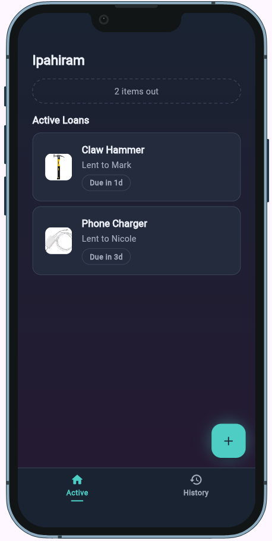
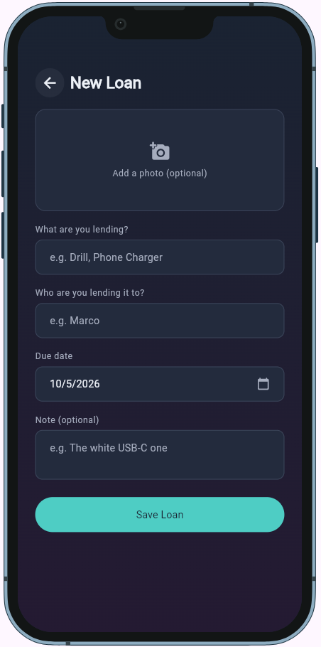
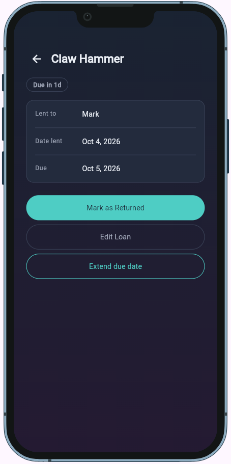
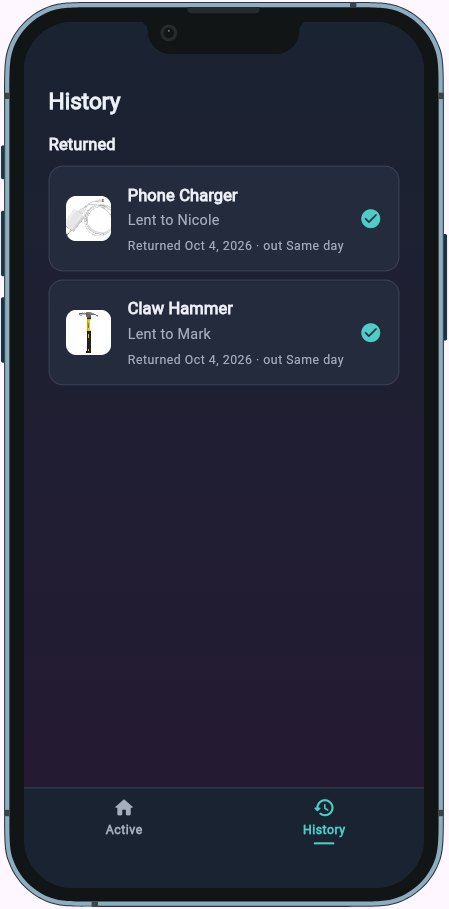

<!--
  This is your project's front page. Replace every placeholder below.
  It is the first thing your instructor and any future employer will read, and
  the live link in it is how your project gets opened for grading.

  New here? Read START-HERE.md first. Delete this comment when you are done.
-->

# Ipahiram

>  A loan tracker for anything you lend to friends — log it, see what's overdue, and mark it returned.


**Live demo:** https://Minatoza.github.io/Ipahiram/ <!-- GitHub Pages is set up already; replace if you host elsewhere -->
**Demo video:** `docs/demo.mp4` (link it here once it exists)
**Course:** Applications Development and Emerging Technologies (6ADET), Holy Angel University
**Author:** Minatoza

This repository lives in the author's own GitHub account and is public on
purpose. There is no `student.json` here and there should not be one: see
`docs/06-security-and-privacy.md` for what a public repo means for secrets and
personal data.

---

## Screenshots

Put two or three real screenshots at phone size in `docs/assets/`, then replace
this paragraph with them:


| Home | New Loan | Item Detail | History |
| --- | --- | --- | --- |
|  |  |  |  |


A repo without screenshots reads as abandoned, whatever the code says.

## What it does

Three to five bullets. What can a user actually do?

- Log an item you lent: what, who to, due date, optional note, optional photo
- See active loans sorted by due date, with Overdue / Due today / Due in Nd badges
- Open a loan to edit it, extend its due date, or mark it returned
- Browse History of returned loans, with days out
- Get a due-date reminder notification on Android/iOS (guarded off on web, where a banner explains this instead)
- Everything is saved on your device and survives a refresh

## Built with

| | |
| --- | --- |
| Framework | Flutter (Dart) |
| State | `ChangeNotifier` repository (`LoanRepository`) + `ListenableBuilder` |
| Storage | shared_preferences (one JSON list, key `ipahiram.loans.v1`) |
| Other packages | `image_picker` (item photos), `flutter_local_notifications` + `timezone` (due-date reminders), `device_preview` (phone frame in both debug and the live demo) |

## Running it yourself

```bash
flutter pub get
flutter run -d chrome
```

Then the app opens in Chrome. Built with Flutter 3.44.8 (stable channel), Dart SDK ^3.8.0 — run `flutter --version` to check yours.

No `.env` setup needed — Ipahiram has no backend and no API keys.

### Environment variables

This project reads its configuration from a `.env` file that is **not** in the
repository. Copy `.env.example`, fill in your own values, and never commit the
result.

| Variable | What it is | Where to get one |
| --- | --- | --- |
| `EXAMPLE_API_KEY` | ... | ... |

## Privacy and secrets

Ipahiram stores loans (item name, borrower's first name, dates, optional
note, optional photo) only on your own device, in browser/local storage
(`shared_preferences`). Nothing is sent anywhere — there is no backend, no
server, and no account. There are no secrets in this repository or in the
deploy workflow; `.env.example` is an unused leftover from the course
template. All sample data, screenshots and the demo video use made-up names
only.

## Project documentation

| Document | |
| --- | --- |
| [Proposal](docs/01-proposal.md) | the problem, the users, the scope |
| [Mockup and wireframes](docs/02-mockup.md) | what it looks like, and the screen flow |
| [Design system](docs/03-design-system.md) | colors, type, spacing, components |
| [Weekly reports](docs/04-weekly-reports.md) | what happened each week |
| [Demo video](docs/05-demo-video.md) | the recording and what it shows |
| [Start here](START-HERE.md) | how this repo works (delete once you have read it) |
| [Security and privacy](docs/06-security-and-privacy.md) | the checklist, filled in |

## Status and what is next

**Works:** logging loans with an optional photo, Item Detail (edit, extend,
return), History, Active/History tabs, saving across a refresh, the web
fallback banner for notifications.

**Known issues:** the reminder notification (`NotificationService`) is fully
implemented and wired into every repository method that adds, edits,
extends, or returns a loan, and is verified not to crash on the web build,
where it's intentionally a no-op. I was not able to complete an on-device
Android test — I got through SDK setup, emulator configuration, and a
Gradle cache failure, but stopped at a Windows Developer Mode requirement I
couldn't enable on this machine (full account in `AI-USAGE.md`). The
computed overdue badge on Home remains the tested, working fallback either
way. The due date field also only picks a day, not a specific time.

## Credits

- Packages: see `pubspec.yaml`
- Icons: Material Symbols (bundled with Flutter)
- No other third-party assets, 3D models, or sounds used

## AI use

Built with Claude (Anthropic) for code suggestions, debugging, and
documentation help throughout the project — covering the core app
structure, Item Detail/History/navigation, the Edit Loan feature, the
reminder notification system, and the item photo feature.


See [AI-USAGE.md](AI-USAGE.md) for the full account, including where the AI
got things wrong and which parts of the code I wrote and debugged myself.


## Licence

MIT, see [LICENSE](LICENSE). 